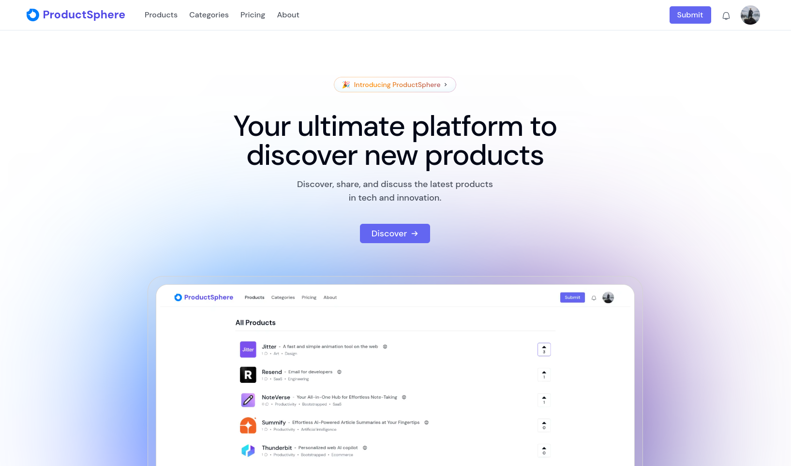

# 📝 ProductSphere



ProductSphere is a community-driven platform built with modern technologies, allowing creators to showcase their products, gather valuable feedback, and connect with an engaged audience.


<br>

## 📚 Usage

To get started with ProducSphere, simply follow these steps:

1. **Visit the App:**
   - Go to the live version of [ProductSphere](https://productsphere.vercel.app/).

2. **Sign In:**
   - Sign in using OAuth (Google or GitHub).

3. **Upload a Product:**
   - Click on the 'Submit' to showcase a new product.
   - Fill in the details and submit your product. 
   - Once submitted, our team will review it to ensure it meets our community guidelines. After approval, your product will be listed and made visible to the community.

4. **Engage with the Community:**
   - View feedback on your products and receive votes and comments.
   - Explore other products and support fellow creators by upvoting and commenting.

5. **Upgrade for More Features:**
   - Unlock premium features like unlimited uploads and advanced analytics by upgrading to a premium plan.


6. **Subscription Management:**
   - If you're on a premium plan, access the Stripe Customer Portal in the Settings to manage your subscription and billing details.

   - Remember to log out when you're finished to keep your account secure.


<br>


## 🚀 Features

- **Seamless Authentication:**
  - 🔑 NextAuth integration with flexible sign-in options (Google, GitHub).
  - Secure, passwordless login for a smooth experience.


- **Product Management:**
  - 📝 Full CRUD (Create, Read, Update, Delete) functionality for product listings.
  - Track feedback and engagement through upvotes and comments.


- **Community Engagement:**
  - 👥 Interactive Community where users can upvote and comment on each other's products.
  - Discover New Products: Explore and support other creators by voting and commenting.

- **Analytics (Premium):**
  - 📊 Advanced Analytics for premium users, providing deeper insights into product engagement. 

- **Subscription & Payment:**
  - 💵 Stripe Integration for handling premium subscription payments..
  - 🔄 Stripe Customer Portal for managing subscriptions and billing details.

- **Deployment:**
  - 😶‍🌫️ Vercel Deployment for fast and reliable performance, ensuring a smooth user experience.

<br>

## 📦 Technologies Used
- **Next.js** for the frontend.
- **TailwindCSS** and **Shadcn UI** for styling.
- **NextAuth** for authentication.
- **Supabase** as the database backend.
- **Prisma ORM** for database queries.
- **Stripe** for payment processing.
- **Vercel** for deployment.

<br>

## 🏗️ Setup

To get a local copy of **ProductSphere** up and running, follow these steps:

### Prerequisites

Make sure you have the following installed:

- [Node.js](https://nodejs.org/) (v16+)
- [npm](https://www.npmjs.com/) or [yarn](https://yarnpkg.com/)
- [NextAuth](https://authjs.dev/) authentication setup
- [Supabase](https://supabase.com/) project and keys
- [Stripe](https://stripe.com/) API keys

### Installation

1. Clone the repository:
   ```bash
   git clone https://github.com/abhish7k/productsphere.git

2. Navigate to the project folder:
    ```bash
    cd productsphere

3. Install dependencies:
    ```bash
    npm install

4. Set up environment variables:
    
    - You can use the provided .env.example file by copying it to .env.local:
      
    ```bash
    cp .env.example .env.local

5. Run the development server:
    ```bash
    npm run dev

6. Visit http://localhost:3000 to view the app.


<br>


